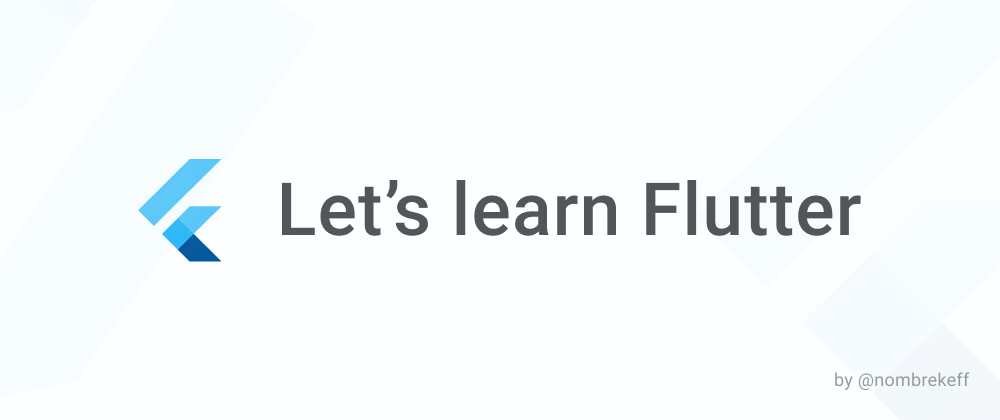

# Let's learn Flutter - Code Repo

This repo contains all the examples showcased in the [Let's learn Flutter series](https://dev.to/nombrekeff/series/14292) I'm doing over on DEV.to.

### What does it cover?
These are some of the thing the series covers:
* Dart language basics
* Flutter basics
* Built in widgets & theming
* Custom widgets
* Routing
* Handling forms & data
* State management options
* Communicating with HTTP APIS
* Build a complete app
* There will be more things not covered in this list, take a look at the Table Of Content further down, it will be updated as the series progresses.

## Contents
* [LLF #4 Widgets explained](./apps/llf_4_what_are_widgets)
* [LLF #5 Flutter styling explained in CSS](./apps/llf_5_flutter_style_in_css)

